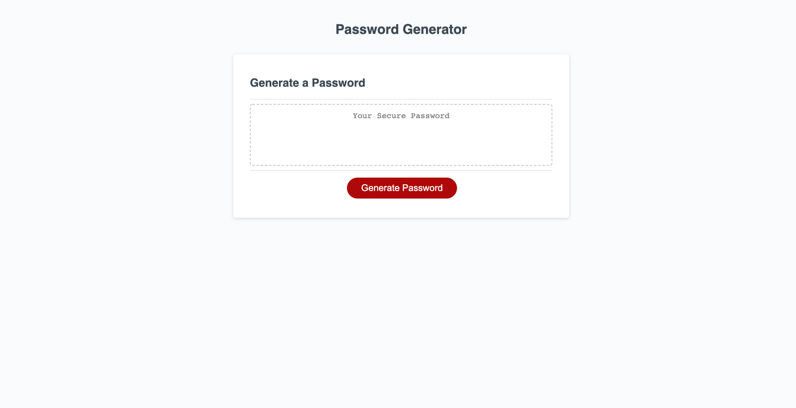

# Week 3 Homework - Password Generator

For this assignment, I was tasked with creating a program that generated a password based on user input. The user determines the length of the password and the type of characters (E.g. lowercase, uppercase, and special characters) that should be included in the password.

## I learned:
1. How to use the "prompt" and "confirm" methods to get user input from dialogue boxes. 
2. How to store the user's input from the dialogue box into a boolean- type variable for later use.
3. How to use the .addEventListener method.
4. How to update content in an HTML document using the .innerHTML method. 

## Example of the Homework Assignment:

#### [Password Generator](https://sranson.github.io/GTBC-WK-3-HW/)

### Acknowledgeable Areas of Improvement going forward:
1. Code Refactoring - there are instances of repeated code that should be refactored and functions that I would have liked to consolidate. 